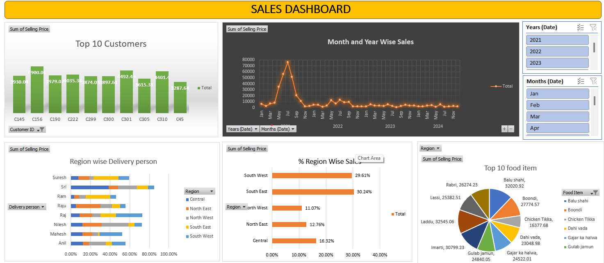

# 📊 Sales Dashboard (Excel Project)

An interactive **Sales Dashboard built in Microsoft Excel**, providing insights into:

- ✅ Top 10 Customers  
- 📈 Month & Year-wise Sales Trend  
- 📦 Region-wise Delivery Person Performance  
- 🌍 % Region-wise Sales Contribution  
- 🍽️ Top 10 Food Items  
- 🎛️ Dynamic Filters using Excel Slicers  

---

## 📁 Project Files

| File Name | Description |
|----------|-------------|
| **Sales Dashboard project.xlsx** | Main dashboard with Pivot Charts & Slicers |
| **Sales raw.xlsx** | Raw dataset used for building the dashboard |
| **image.png** | Dashboard screenshot used in README |

---

## 📌 Dashboard Highlights

### 🔹 **1. Top 10 Customers**
Bar chart showing highest revenue-generating customers based on selling price.

### 🔹 **2. Month & Year-wise Sales**
A line chart to visualize sales trends over multiple years.

### 🔹 **3. Region-wise Delivery Person**
Stacked bar chart showing each delivery person’s contribution within regions.

### 🔹 **4. % Region-wise Sales**
Horizontal bar chart showing contribution of each region to total sales.

### 🔹 **5. Top 10 Food Items**
A colorful pie chart displaying top-selling food items.

---

## 🚀 How to Use This Dashboard

1. Download **Sales Dashboard project.xlsx**
2. Open in **Excel (2016 or later)**  
3. Use slicers (Years, Months, Region, Food Item) to interact with the dashboard  
4. To refresh updated data:  
   `Data > Refresh All`

---

## 🛠 Tools & Skills Used

- Microsoft Excel  
- Pivot Tables  
- Pivot Charts  
- Slicers & Filters  
- Data Cleaning  
- Dashboard Design  

---

